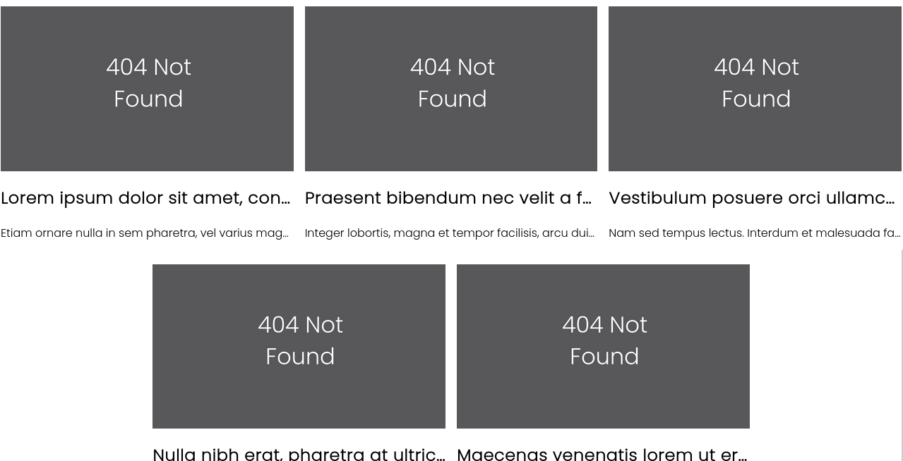
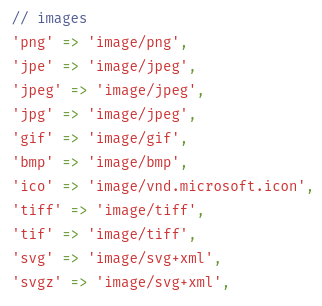
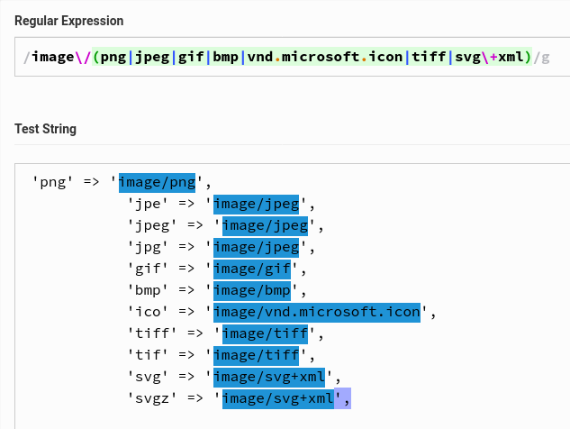
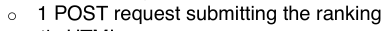
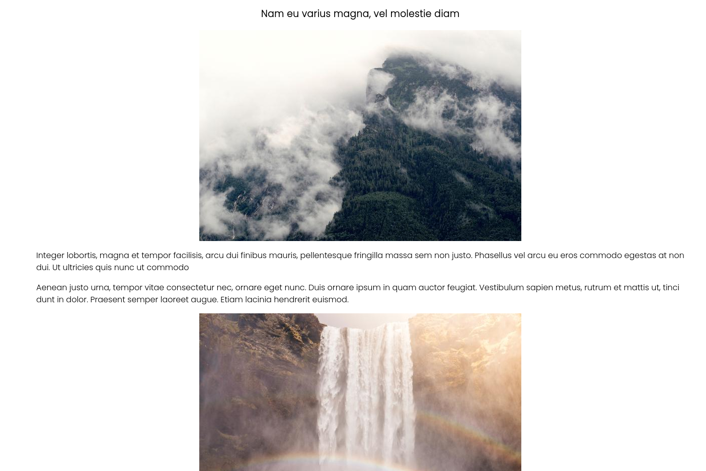
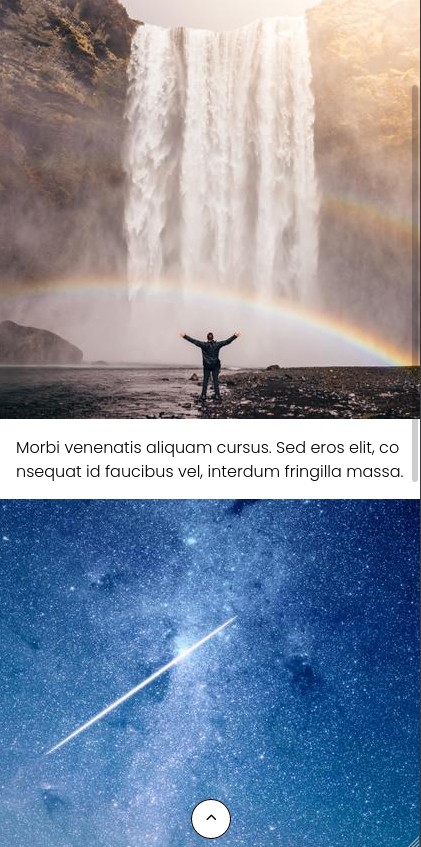
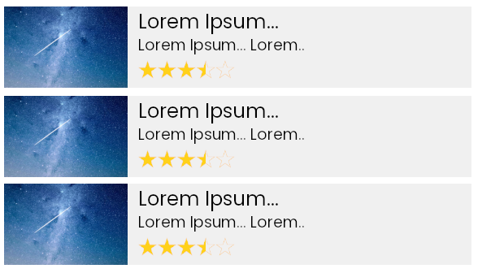

### Notes
___

Here are some notes about the react article ranker that I have created. It's also vital you know how I'd approach other tasks I haven't completed.

### Table of Contents:
- [Issues](#issues)
	- [Article Preview](#article-preview)
	- [Regex Image Test](#regex)
- [Missing Feature](#missing-feature)
	- [How'd I'd Implement it](#how-id-implement-it)
- [What I'd Improve](#what-id-improve)
- [Designs](#designs)
	- [Desktop](#desktop)
	- [Mobile](#mobile)
	- [Voting](#voting-design)
- [Final Thoughts](#final-thoughts)

## Issues
___

Here is a list of some of the things I am currently aware of that need fixing.

#### Article-Preview
The image will always return a default fallback image currently. E.g.


In the current implementation ArticlePreviews and Articles are made at the same.

There shouldn't be an issue (normally). It's because of how I've implemented the Images component. Currently, it follows the link you provide. I'll show you an example of what I mean: https://picsum.photos/640/420?random

It will return the image url in my case I got this: https://i.picsum.photos/id/814/640/420.jpg?hmac=SeqwPqaNiIFYy95ezXV31-e_Ferk7NOj_kw7bBm2ROg


#### Fix??
and when the items are created, it does not know the url. I could switch it to async and pass it after the article has been created or create a class which does it ahead of time and pass the response into the props.

___

#### Regex
___

as mentioned above with the current implementation of image. It follows the link. I need to confirm that is of a valid type. These are the current types, I was hoping to support.



here is the current regex that I have created, but it sadly throwing false negatives.

```javascript
const regexFilter : RegExp = new RegExp('image\/(png|jpeg|gif|bmp|vnd.microsoft.icon|tiff|svg\+xml)', 'gi')
```

This is me testing it on regextester.com



I have probably done something wrong but with more time I would have implemented the feature where it will check the content-type and if it's valid, display else use the fallback URL.


### Missing-Feature
___

Okay, now that we've gone over the bugs. Let's talk about the missing feature I didn't implement. (this is because I learnt to use React while doing this, Axios and Enzyme at the same time)


While I haven't implemented it, I would like to talk to you about my approach. So let's get started.

So first we can see from the document provided that we need a post request.


from my knowledge, you can either create a post request using fetch(), create your own XHR request (XML HTTPRequest), use Axios or use an HTTP form. For this, I'm going to use Axios as it has better backwards compatibility. 

#### How-Id-Implement-it

So, I imagine the database / script we're sending the request to would contains these fields 

| Id | ArticleId | Rating |
| -- | --------- | ------ |
| 1  | 2         | 5 

then at a later point, you could use the data to get the average rating of the content. Serve certain articles based on popularity/hits (hot articles or something similar) or even sort by geolocation (if you added an extra field).

```javascript

// standard post request
const url = INSERT_URL_HERE
const data = { articleId=1&rating=5 };

const res = await axios.post(url, data);

// request with the header content-type passed in
const res2 = await axios.post(url, data, {
	headers: {
		'content-type' : 'text/json'	
	}
});

```


#### What-Id-Improve
___

There are quite a few things I'd improve but from not knowing react to being able to creat something like this was a huge learning curve for me.

Okay, so Firstly as mentioned in [Issues](#issues), If I could do this again I would create the article asynchronously and then load the preview list (If I followed the same design pattern). 

But if I had redone it, I would probably end up using react-js routing (the reason being, this allows you to use the window.history (pushState) to actually go back and forth between pages	)

```javascript
<Router>
	<div>
		<Route exact path="/article1" component={Article{1}} /> 
		<Route path="/article2" component={Article{2}} /> 
		<Route path="/article3" component={Article{3}} />
	</div>
</Router>
```

While this approach follows a more static website. We could do the same with dynamic routing and an example I found online [here](https://github.com/jonathanbrierre/Sample-Shirt-Router) (because who wants to write all those routes themselves).

I'd also want to split up the CSS as some of the stylings may not be used on other pages. Which in turn would decrease load time, the only reason I did that during my implementation is that they are all technically on one page...

I also don't recommend doing what I did for a huge website, as it loads all the articles in the background (users won't even see half of them).

#### Designs
___

### Desktop
So when it comes to design, I'm not an expert and nor will I pretend to be one. But I went for a very simplistic design here a standard type blog template. When I program or make things I care about user experience (because the last thing you want to do is potentially annoy a customer)



the above photo is the view when you're viewing an article, there isn't much to it as the task didn't require it. But if I had the choice, I would have added a navbar.


### Mobile




In the above picture, I have added a scroll to the top button as it ruins the mobile experience (I think so at least). I understand it's an article, but sometimes infinitely scrolling can be a pain haha. **Note:** this button is also included on the [Desktop](#desktop) view.


### Voting-Design

I am in no way a designer but for the voting system, I think something like this might be a good idea as it's quite simplistic and there's a max of 5 articles to load. People can't get confused, and I'd pop it up afterwards in a modal or something similar with a transparent black background.



---


### Final-Thoughts

so it's about time that we wrap this up. I just have a few words. I want to thank you for the opportunity as I have learnt a lot during the time building this simple web-based program and I hope you have a good day/weekend.